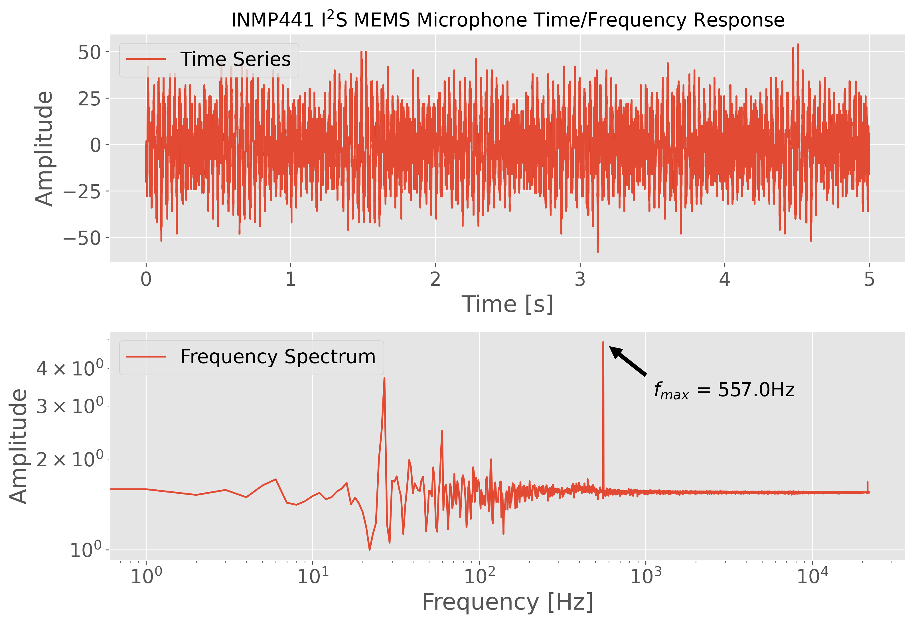
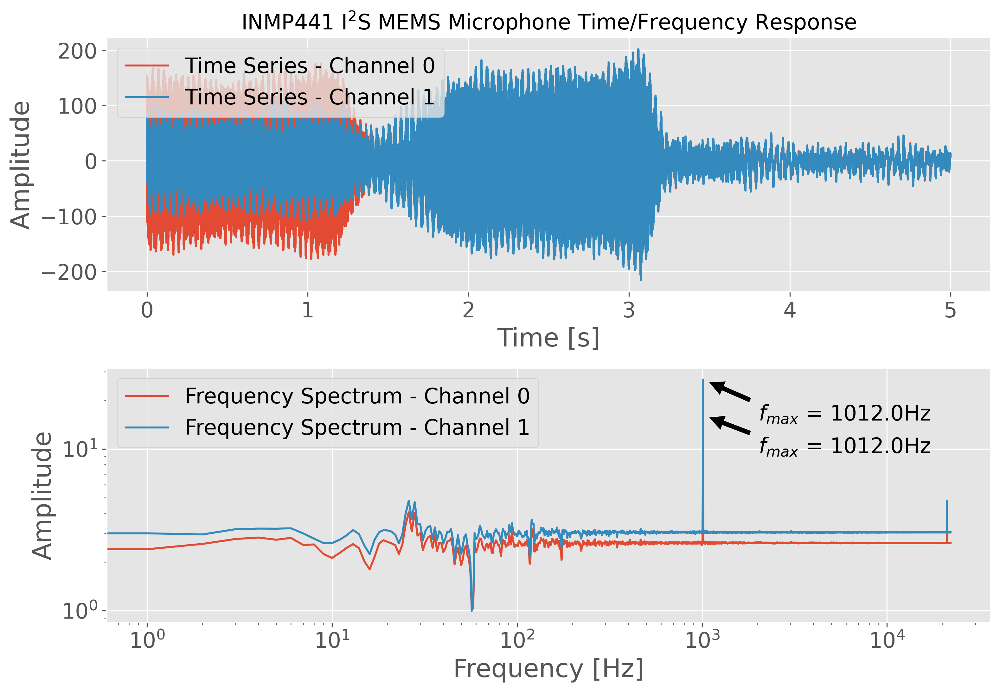

# I2S Microphone Recording on Raspberry Pi with Python
Python codes that read, save, and analyze audio input from I2S MEMS microphones on a Raspberry Pi

Raspberry Pi boards are capable of recording stereo audio using an interface called the inter-IC sound (I2S or I2S) bus. The I2S standard uses three wires to record data, keep track of timing (clock), and determine whether an input/output is in the left channel or right channel. First, the Raspberry Pi (RPi) needs to be prepped for I2S communication by creating/enabling an audio port in the RPi OS system. This audio port will then be used to communicate with MEMS microphones and consequently record stereo audio (one left channel, one right channel). Python iS then used to record the 2-channel audio via the pyaudio Python audio library. Finally, the audio data will be visualized and analyzed in Python with simple digital signal processing methods that include Fast Fourier Transforms (FFTs), noise subtraction, and frequency spectrum peak detection.

The full tutorial can be found at: https://makersportal.com/blog/recording-stereo-audio-on-a-raspberry-pi

## Mono Wiring 

## Stereo Wiring

## Mono Output

*Example Output for 557Hz Test Frequency*:

## Stereo Output

*Example Stereo Output for 1012Hz Test Frequency*:

