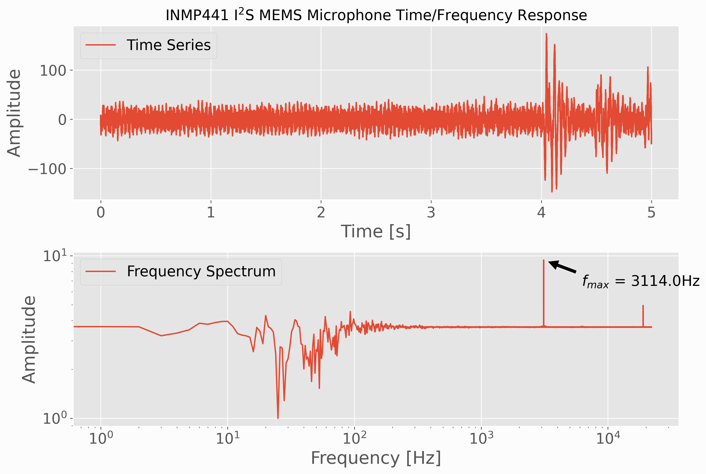

# I2S Microphone Recording on Raspberry Pi with Python

## Wiring
This folder contains codes that plot city shapefiles in Python using 'cartopy' 
This folder also contains codes that plot the national land cover database (NLCD) product across the USA and given cities

These codes are the backbone of the satellite analyses

*Example Output*:

